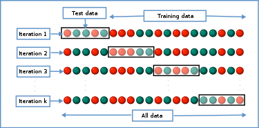

# Evaluation  

## Training vs Testing  

We should first address the concepts of training and testing. 

## Metrics  

### Continuous Responses  

### Discrete Responses  

## Overfitting   

## Cross Validation  

One very standard way of evaluation is $k$-fold cross validation, commonly with $k=5$ or $k=10$. The idea is simple. Divide the data into $k$ groups. Each time, choose $k-1$ groups for training, fit the model on the last group, which is the test data, and calculate the desired metrics, such as MSE. 

In this way, although less data is used for training, the metrics are more accurate, because now we are not using the same data points for training and testing. Using metrics from cross validation for model selection can ensure that your model does not overfit, which means the model does well with training data but does not generalize well on new data.  


```{r, include = FALSE}
show_fig <- function(f)
  {if (knitr::is_latex_output())
  {
    output = xfun::with_ext(f, 'pdf')
    rsvg::rsvg_pdf(xfun::with_ext(f,'svg'), file=output)
  } else {
    output = xfun::with_ext(f, 'svg')
  }
  knitr::include_graphics(output)
}
```


```{r, fig.cap="Image Source: https://en.wikipedia.org/wiki/Cross-validation_(statistics)", echo = FALSE}
show_fig("images/K-fold_cross_validation_EN.svg")
```


```{r, include = FALSE}
# You can also use math in footnotes like this^[where we mention $p = \frac{a}{b}$].

# We will approximate standard error to 0.027[^longnote]

# [^longnote]: $p$ is unknown but expected to be around 1/3. Standard error will be approximated

    # $$
    # SE = \sqrt(\frac{p(1-p)}{n}) \approx \sqrt{\frac{1/3 (1 - 1/3)} {300}} = 0.027
    # $$

```

```{r, include = FALSE}
# 
```

